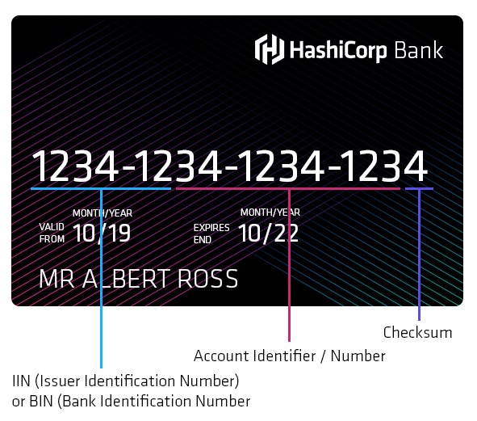

import Tabs from '@theme/Tabs';
import TabItem from '@theme/TabItem';

Vault 1.4 introduced new feature called Transform. Transform is a Secrets Engine that allows Vault to encode and decode sensitive values residing in external systems such as databases or file systems. This capability allows Vault to ensure that when an encoded secret’s residence system is compromised, such as when a database is breached and its data is exfiltrated, that those encoded secrets remain uncompromised even when held by an adversary.

This post will show you how to implement Transform secrets into a simple API, source code is provided for both the Java and Go programming languages. 

For information on the technical detail behind the Transform engine please see Andy's excelent article [https://www.hashicorp.com/blog/transform-secrets-engine](https://www.hashicorp.com/blog/transform-secrets-engine).

## API Structure
Our example application is a simple RESTful payment service, backed by a PostgreSQL database, there is a single route which accepts a POST request.

```
POST /order
Content-Type: application/json
```

### Request
The data for the API is sent as JSON and has three fields for the `card number`, the `expiration` and the `cv2`.

```json
{
  "card_number": "1234-1234-1234-1234",
  "expiration": "10/12",
  "cv2": "123"
}
```

### Response

On a succesfull call to the API, the data is saved to the database and a transaction ID is returned to the caller.

```json
{
  "transaction_id": "1234"
}
```

## Requirements
The API operates asynchronously, it does not immedidately process the payments for the orders, instead it stores the card numbers in a PostgreSQL database until another application picks them up for processing. The security requirements for the API are:

* Credit card details must be stored in the database in an encrypted format
* It must be possible to query details of the card number without decrypting it

The first requirement is fairly trivial to solve using Vault and the [Transit Secrets Engine](https://www.vaultproject.io/docs/secrets/transit/). Transit secrets can be used as encryption as service to encrypt the credit card details before they are written to the database. 

To satisfy the second requirement, you need to be able to query the type of the card and the bank which issued it, you can get this data from the card number as not all the data in a credit card number is unqiue. A credit card number is composed from three different parts, the `Issuer Number`, the `Account Number` and the `Checksum`.



`Issuer Number` relates to the type of the card (first digit), and the issuers code this is the information which you would like to query to satisfy the second requirement.

`Account Number` is the unique identifier assigned to the holder of the card

`Checksum` is not a secret part of the card number instead it is desined for quick error checking. The checksum is generated from the card number, before processing the checksum is regenerated using the Luhn algorithm if the given and the computed checksums differ then the card number has been entered incorrectly. 

To be able to query the card issuer you realistically have two options:

1. Partially encrypt the card number in the databse
1. Store metadata for the card along with the encrypted values

To implement this requirement in code, the developers have the responsiblity for managing the complexity of partially encrypting the credit card data, and information security need to worry about the correct implementation of this.

## Transform Secrets Engine
To simplify the process while still satisfing the second requirement, Vault's `Transform Secrets Engine` can be used. Transform allows you to encrypt data while preserving formatting or to partially encrypt data based on user configurable formula. The definition for the encryption process can be be centraly managed by the info security team, and the developers can use the Transform API allowing them to encrypt the card numbers. 

In our usecase where there is a need to partially encrypt the credit card numbers leaving the issuer as queryable data, a transform could be defined which takes the card number, for example `1234-5624-6310-0053`, encrypts the sensitive parts, while retaining the formatting and the ability to infer information about the card type and issuing bank. 

Transforms are defined as regular expressions, the capture groups inside the expression is replaced with cyphertext, anything outside the match groups is left in the original format. To encrypt only the account number and checksum for your cards you could use the following regular expression.

```
\d{4}-\d{2}(\d{2})-(\d{4})-(\d{4})
```

Given an input credit card number:

```
1234-5611-1111-1111
```

Vault would return the cyphertext:

```
1234-5672-6649-0472
```

Note the first 6 digits have not been replaced with cyphertext as there are no capture groups in the regular expression for this text, the formatting of the data is also preserved as this was outside the capture groups.

## Real world impact of partially encrypting data
You may be wondering, by only encrypting the account number and cv2 data are you reducing the level of security for storing the card number?

The short answer is yes, but in real terms it probably does not make a difference.

A number containing 16 digits has a possibility of **16^16** combinations, including the CV2 number this roughly equates to **10 quintillion** different permiatations. 

If you only store 10 digits of the card number plus the CV2 this is **10^13**, or about **10 trillion** combinations. 

In reality, since the first 6 digits of a card number are the issuer and card type, there are not 1 million different issuers, lets say there are 10,000, storing the full 16 digits would give you roughly **100 quadrillion** combinations. In both cases we need to remove the checksum so we get **10 quadrillion combinations** if you encrypt the account number and **1 trillion** if you do not. 

Yes, not encrypting the issuer means someone can make less guesses to determine the number but they still need to make **1 trillion guesses**. Assuming someone managed to obtain your database containing partially encrypted card numbers. If you had an average API request time of 100ms to accept or reject a payment, it would take about **190258 years** for someone to brute force a payment. Even if the attacker was running parralel attacks the odds are heavily stacked against them. 

Fun math to one side, since we have determined it is secure to partially encrypt these credit card numbers, let's see how to do it.

## Configuring Transform Secrets

The Transform secrets engine is only available with **Vault Enterprise version 1.4** and above. With all versions of Vault, only the the Key/Value engine and the Cubbyhole secrets engines are enabled by default. To use the Transform Secrets Engine it first needs to be enabled, you can use the following command.

```shell
vault secrets enable transform
```

<Terminal target="vault.container.shipyard.run" shell="/bin/sh" workdir="/" user="root" expanded />
<p></p>

To encrypt data with the transform secrets engine, there are several resources which encapsulating different aspects of the transform process that need to be configured. These are:

* **Roles** - Roles are the basic high-level construct that holds the set of transformation that it is allowed to performed. The role name is provided when performing encode and decode operations.

* **Transformations** - Transformations hold information about a particular transformation. It contains information about the type of transformation that we want to perform, the template that it should use for value detection, and other transformation-specific values such as the tweak source or the masking character to use.

* **Templates** - Templates allow us to determine what and how to capture the value that we want to transform.

* **Alpahbets** - Alphabets provide the set of valid UTF-8 character contained within both the input and transformed value on FPE transformations.

Let's walk through each of the steps.

### Roles

First we need to create a role called `payments`, when creating the role you provide the list of transformations which can be used from this role using the `transformations` parameter. The trasformation `ccn-fpe` referenced in the example role below has not yet been created, you will do that in the next step; you can still create the role, the `transformations` parameter is a "soft" constraint, you can also update transformations in a role after it has been created.

```shell
vault write transform/role/payments transformations=ccn-fpe
```

<Terminal target="vault.container.shipyard.run" shell="/bin/sh" workdir="/" user="root" />
<p></p>

### Transformations

Next we create a transformation called `ccn-fpe`, this is the same name that was referenced when you create the role in the previous step. The parameter `type` defines the transform operation you would like to perform, this has two possible values:

* `fpe` - use Format Preserving Encryption using the FF3-1 algoryrthm
* `masking` - this process replaces the sensitive characters in a transformation with a desired character but is not reversable. 

`tweak_source` is a non-confidential value which is stored alongside the ciphertext used when performing encryption and decryption operations. This parameter takes one of three permissible values, `supplied`, `generated`, `internal`. This example uses the `internal` value which delegates the creation and storage of the tweak value to Vault. More information on tweak source can be found in the Vault documentation, [https://www.vaultproject.io/docs/secrets/transform#tweak-source](https://www.vaultproject.io/docs/secrets/transform#tweak-source).

The `template` parameter relates to the template which will be used by the transform, you can define templates and reuse them across multiple different transformations. Vault has two built in Templates which can be used `builtin/creditcardnumber` and `builtin/socialsecuritynumber`.

Finally, you specify the `allowed_roles`, specifying allowed roles ensures that the creator of the role is allowed to use this transformation.

```
vault write transform/transformation/ccn-fpe \
type=fpe \
tweak_source=internal \
template=ccn \
allowed_roles=payments
```

<Terminal target="vault.container.shipyard.run" shell="/bin/sh" workdir="/" user="root" />
<p></p>

### Templates

The template defines what in the data is encrypted by the transform, templates are specfied as regular expressions, the capture groups in the expression define 
the elements of the input which will be replaced with cyphertext.

The below example creates a template called `ccn`. The `type` parameter is set to `regex` which is currently the only option supported by the backend. Then you specify a `pattern` as a valid regular expression. For `fpe` transformations you need to specify the `alphabet`, the `alphabet` is a custom character set which will be used in the outputed cyphertext. `alphabet` can either be a custom alphabet like the example below or one of the [built in](https://www.vaultproject.io/docs/secrets/transform#alphabets) values.

```shell
vault write transform/template/ccn \
type=regex \
pattern='\d{4}-\d{2}(\d{2})-(\d{4})-(\d{4})' \
alphabet=numerics
```

<Terminal target="vault.container.shipyard.run" shell="/bin/sh" workdir="/" user="root" />

### Alphabets

Creating custom alphabets is an optional step for a transform, Vault has a number of built in alphabets covering common usecases however you wish your cypher text to be composed of a specific set of unicode characters. To define a custom alphabet you use the following command, this command creates a custom alphabet called `numerics`  using the characters `0-9`.

```shell
vault write transform/alphabet/numerics \
alphabet="0123456789"
```

<Terminal target="vault.container.shipyard.run" shell="/bin/sh" workdir="/" user="root" />
<p></p>

## Testing the transform

Now all of the components have been configured you can test the setup by writing data to the path `transform/encode/payments`, the part of the path `payments` refers to the name of your transform created in the previous steps.

```
vault write transform/encode/payments value=1111-2222-3333-4444
```

<Terminal target="vault.container.shipyard.run" shell="/bin/sh" workdir="/" user="root" />

You will see an output which looks similar to the following. Note that the first 6 digits of the returne cyphertext are the same as the original data.

```
Key              Value
---              -----
encoded_value    1111-2200-1452-4879
```

To decode this cyphertext and reverse the operation, you write data to the `transform/decode/payments` path.

```
vault write transform/decode/payments value=<encoded_vaule>

vault write transform/decode/payments value=1111-2200-1452-4879
```

You will see output which looks similar to the below example:

```shell
Key              Value
---              -----
decoded_value    1111-2222-3333-4444
```

<p>
  <Terminal target="vault.container.shipyard.run" shell="/bin/sh" workdir="/" user="root" />
</p>


## Using Transform in your application

So far you have seen how you can use the Transform engine using the CLI, to use the transform engine from your application you need to use Vault's API, everything possible using the CLI is also possible using the RESTful API. To interact with the Vault API you have three options:

1. Use one of the [Client libraries](https://www.vaultproject.io/api/libraries.html)
1. Code generate your own client using the [OpenAPI v3 specifications](https://www.vaultproject.io/api-docs/system/internal-specs-openapi)
1. Manually interact with the HTTP API 

This example is going to demonstrate the third option, as this demonstrates the simplicity with interacting with Vault's API.

The example application only needs to encode data, and not manage the configuration for Transform, to do this it only needs to interact with a single API endpoint which is Encode.

https://www.vaultproject.io/api-docs/secret/transform#encode


## Using the Transform Encode API

To encode data using transform secrets engine, you `POST` a JSON payload to the path `/v1/transform/encode/:role_name`, in this example `:role_name` is `payments`, which is the name of the role created earlier. 

The API requires that you have a valid Vault token and that token has the correct policy allocated to it in order to perform the operation. The Vault token is sent to the request using the `X-Vault-Token` HTTP header. 

The payload for the request is a simple JSON structure with a single field `value`, you can see an example below

```json
{
  "value": "1111-2222-3333-4444"
}
```

If we were to use `cURL` to submit this request the code would look like this:

```shell
curl localhost:8200/v1/transform/encode/payments \
  -H 'X-Vault-Token: root' \
  -d '{"value": "1111-2222-3333-4444"}'
```

Vault returns the cyphertext inside the JSON response, this value is returned at the path `.data.encoded_value` as shown in the example output below.

```json
{
  "request_id": "0f170922-d7c1-0137-391b-932a2025beb4",
  "lease_id": "",
  "renewable": false,
  "lease_duration": 0,
  "data": {
    "encoded_value": "1111-2208-4340-0589"
  },
  "wrap_info": null,
  "warnings": null,
  "auth": null
}
```

Now you understand the basics with interacting with the API let's see how this can be done from your applications code.

## Interacting with the Vault API from Java and Go

The first thing we need to do is to construct a byte array which holds a JSON formatted string for your payload.

<Tabs
  defaultValue="go"
  values={[
    { label: 'Go', value: 'go', },
    { label: 'Java', value: 'java', }
  ]
}>

<TabItem value="go">

```go
// create the JSON request as a byte array
req := TokenRequest{Value: cc}
data, _ := json.Marshal(req)
```

</TabItem>

<TabItem value="java">

```java
// create the request
TokenRequest req = new TokenRequest(cardNumber);

// convert the POJO to a byte array 
ObjectMapper mapper = new ObjectMapper();
mapper.enable(SerializationFeature.INDENT_OUTPUT);
byte[] byteRequest = mapper.writeValueAsBytes(req);
```

</TabItem>

</Tabs>

You can then construct the request, setting this payload as part of the request body.

<Tabs
  defaultValue="go"
  values={[
    { label: 'Go', value: 'go', },
    { label: 'Java', value: 'java', }
  ]
}>

<TabItem value="go">

```go
url := fmt.Sprintf("http://%s/v1/transform/encode/payments", c.uri)
r, _ := http.NewRequest(http.MethodPost, url, bytes.NewReader(data))
r.Header.Add("X-Vault-Token", "root")

resp, err := http.DefaultClient.Do(r)
if err != nil {
	return "", err
}
defer resp.Body.Close()

if resp.StatusCode != http.StatusOK {
	return "", fmt.Errorf("Vault returned reponse code %d, expected status code 200", resp.StatusCode)
}
```

</TabItem>

<TabItem value="java">

```java
// make a call to vault to process the request
URL url = new URL(this.url);
HttpURLConnection con = (HttpURLConnection)url.openConnection();
con.setDoOutput(true);    
con.setRequestMethod("POST");
con.setRequestProperty("Content-Type", "application/json; utf-8");
con.setRequestProperty("Accept", "application/json");
con.setRequestProperty("X-Vault-Token", this.token);

// write the body
try(OutputStream os = con.getOutputStream()) {
  os.write(byteRequest, 0, byteRequest.length);           
}
```

</TabItem>

</Tabs>

To read the JSON response, you can parse the response body from the HTTP client into a simple structure. 

<Tabs
  defaultValue="go"
  values={[
    { label: 'Go', value: 'go', },
    { label: 'Java', value: 'java', }
  ]
}>

<TabItem value="go">

```go
// process the response
tr := &TokenResponse{}
err = json.NewDecoder(resp.Body).Decode(tr)
if err != nil {
	return "", err
}
```

</TabItem>

<TabItem value="java">

```java
// read the response
TokenResponse resp = new ObjectMapper()
  .readerFor(TokenResponse.class)
  .readValue(con.getInputStream());
```

</TabItem>

</Tabs>

Full source code for both examples can be found at: [https://github.com/nicholasjackson/demo-vault/tree/master/transform](https://github.com/nicholasjackson/demo-vault/tree/master/transform)

## Testing the service

Let's test the service, the demo has both the Java and the Go code running, so you can use `curl` to test it.

<Tabs
  defaultValue="go"
  values={[
    { label: 'Go', value: 'go', },
    { label: 'Java', value: 'java', }
  ]
}>

<TabItem value="go">

```shell
curl payments-go.container.shipyard.run:9090 -H "content-type: application/json" -d '{"card_number": "1234-1234-1234-1234"}'
```

</TabItem>

<TabItem value="java">

```shell
curl payments-java.container.shipyard.run:9090 -H "content-type: application/json" -d '{"card_number": "1234-1234-1234-1234"}'
```

</TabItem>
</Tabs>

<p>
  <Terminal target="payments-go.container.shipyard.run" shell="sh" workdir="/" user="root"/>
</p>

You should see a response something like the following

```json
{"transaction_id": 11}
```

If you query the orders table on the database you will be able to see the encrypted value for this transaction

```
PGPASSWORD=password psql -h localhost -p 5432 -U root -d payments -c 'SELECT * from orders;'
```

<p>
  <Terminal target="postgres.container.shipyard.run" shell="/bin/bash" workdir="/" user="root"/>
</p>

You can validate that this cyphertext is correct using the CLI like in the earlier example:

```shell
vault write transform/decode/payments value=<card_number>
```

<Terminal target="vault.container.shipyard.run" shell="sh" workdir="/" user="root"/>

## Summary

In this demo you have seen how the new Transform secrets engine can be used to partially encrypt credit card numbers at reset, enabling you to preseve both the formatting and to query the issuer. You have seen:

* How you can configure Transofrm secrets
* Interact with Transform using the CLI
* Interact with Transform using the API
* Examples of of use for Go and Java.

This example only covers one of the possibilities for the Transform secrets engine, if you have an interesting use case for Transform let us know we would love to feature this in a future post.